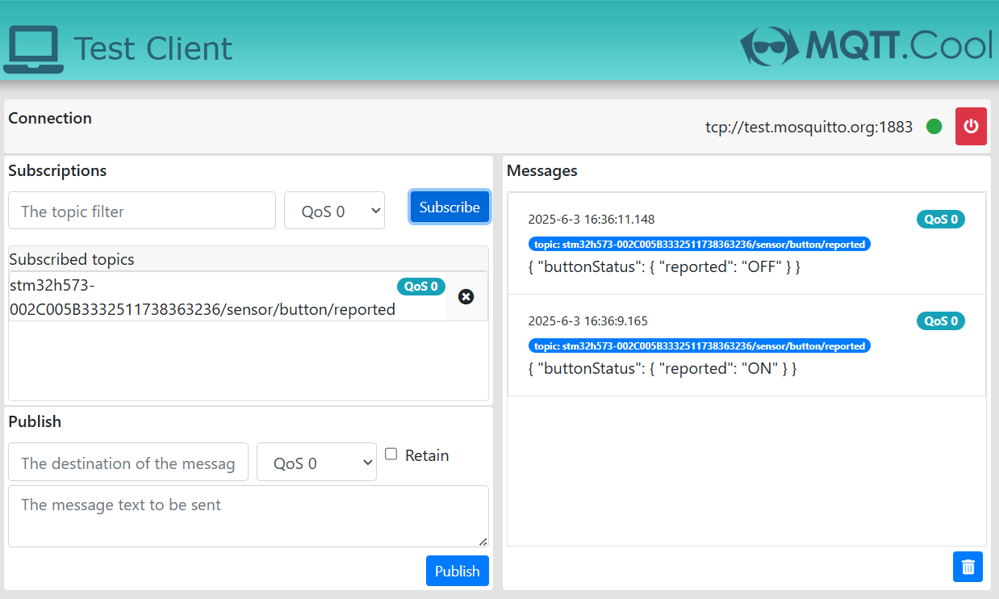
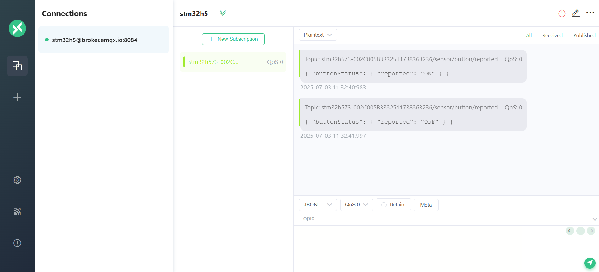

# STM32U585 MQTT Button Status Example (button_task.c)

This example publishes USER button state from **B-U585I-IOT02A** to MQTT whenever the button changes.

## MQTT Topic

- Report topic: `<thing_name>/sensor/button/reported`

Example thing name:
- `stm32u585-002C005B3332511738363236`

## Report Payload

Button released:

```json
{
  "buttonStatus": {
    "USER_Button": {
      "reported": "OFF"
    }
  }
}
```

Button pressed:

```json
{
  "buttonStatus": {
    "USER_Button": {
      "reported": "ON"
    }
  }
}
```

## Monitor Messages

1. Subscribe to `<thing_name>/sensor/button/reported`
2. Press/release USER button
3. Observe state updates

Tools:
- AWS IoT MQTT test client
- mqtt.cool (`test.mosquitto.org`)
- MQTTX Web (`broker.emqx.io`)
- `mosquitto_sub`

Option: EMQX (MQTTX Web)

1. Open https://mqttx.app/web-client
2. Connect to `broker.emqx.io` (MQTT, port `1883`).
3. Subscribe to `<thing_name>/sensor/button/reported`.
4. Press/release USER button and observe updates.

Screenshots:
- 
- 

## Firmware Notes

`vButtonTask()`:
- registers GPIO rising/falling callbacks
- waits on FreeRTOS event bits
- publishes consolidated JSON button state

State mapping is based on `USER_BUTTON_ON` configuration in firmware.
