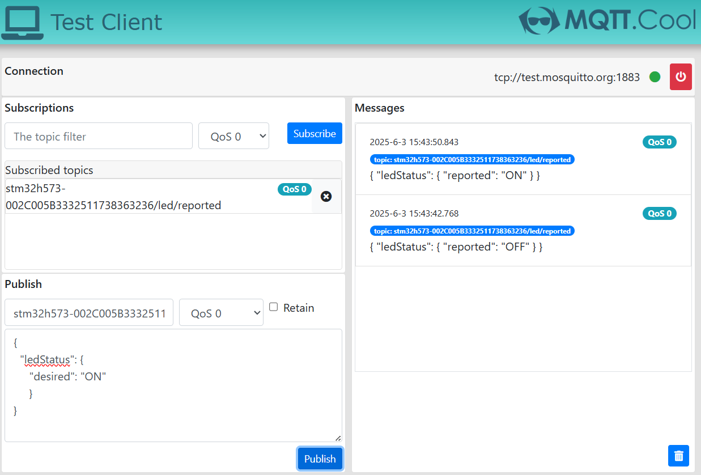
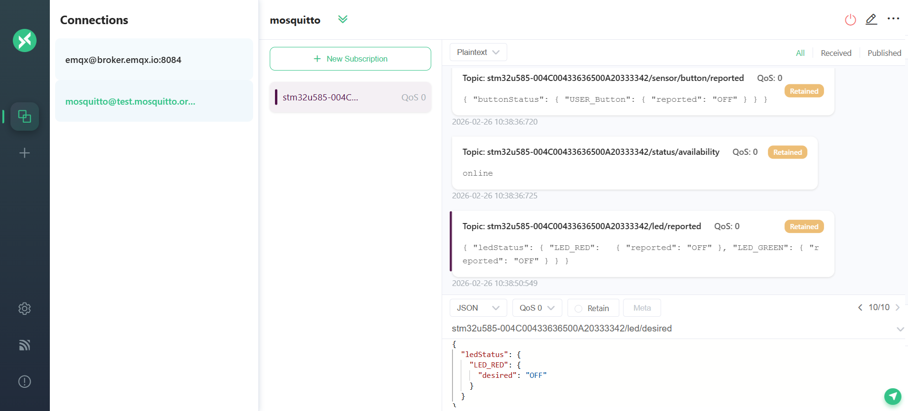

# STM32U585 MQTT LED Control Example (led_task.c)

This example shows how to control onboard LEDs on **B-U585I-IOT02A** over MQTT and report current LED state back to the broker.

## MQTT Topics

- Command topic: `<thing_name>/led/desired`
- Report topic: `<thing_name>/led/reported`

Example thing name:
- `stm32u585-002C005B3332511738363236`

## Command Payloads

### JSON command (recommended)

Turn LED red ON:

```json
{
  "ledStatus": {
    "LED_RED": {
      "desired": "ON"
    }
  }
}
```

Turn LED red OFF:

```json
{
  "ledStatus": {
    "LED_RED": {
      "desired": "OFF"
    }
  }
}
```

### Raw command fallback (supported)

- `LED_RED_ON`
- `LED_RED_OFF`
- `LED_GREEN_ON`
- `LED_GREEN_OFF`

## Report Payload

The firmware publishes LED status as JSON:

```json
{
  "ledStatus": {
    "LED_RED": {
      "reported": "ON"
    },
    "LED_GREEN": {
      "reported": "OFF"
    }
  }
}
```

## Monitor and Test

1. Subscribe to `<thing_name>/led/reported`
2. Publish control payloads to `<thing_name>/led/desired`

You can use any MQTT client to monitor and control LED status. Below are two recommended web clients:

Option 1: mqtt.cool for `test.mosquitto.org`

Option 2: MQTTX Web Client for `broker.emqx.io`

Example screenshots:
- 
- 

## Firmware Notes

`vLEDTask()`:
- waits for MQTT readiness
- subscribes to desired topic
- applies LED updates
- publishes reported state

The parser supports both JSON and raw-string command formats.
