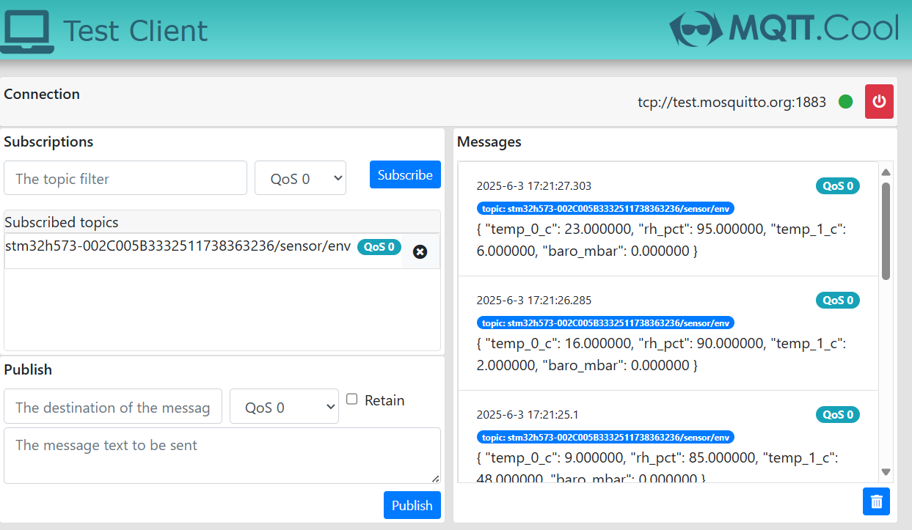
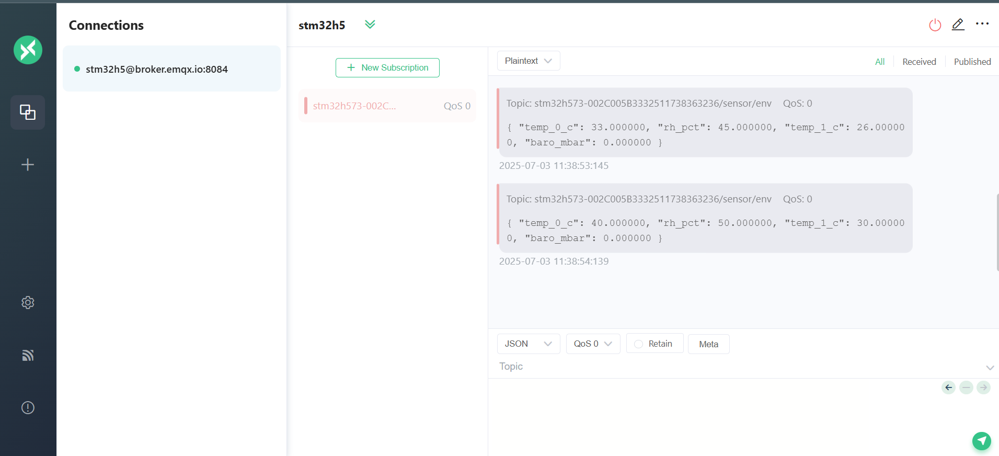

# STM32U585 MQTT Environmental Sensor Example (env_sensor_publish.c)

This example publishes environmental telemetry from **B-U585I-IOT02A** to MQTT.

## MQTT Topic

- Publish topic: `<thing_name>/sensor/env`

Example:
- `stm32u585-002C005B3332511738363236/sensor/env`

## Payload Format

Default payload:

```json
{
  "temp_0_c": 22.30,
  "temp_1_c": 22.10,
  "rh_pct": 50.20,
  "baro_mbar": 998.10
}
```

When `DEMO_LIGHT_SENSOR == 1`, light metrics are added:

```json
{
  "temp_0_c": 22.30,
  "temp_1_c": 22.10,
  "rh_pct": 50.20,
  "baro_mbar": 998.10,
  "als_lux": 120,
  "white_lux": 140
}
```

## Publish Behavior

- Periodic publish interval is defined in firmware (`MQTT_PUBLISH_TIME_BETWEEN_MS`)
- Data source depends on sensor configuration (`USE_SENSORS`, `DEMO_LIGHT_SENSOR`)

## Monitor Messages

You can use any MQTT client to monitor environmental sensor data. Below are two recommended web clients:

Option 1: mqtt.cool for `test.mosquitto.org`

Option 2: MQTTX Web Client for `broker.emqx.io`

Subscribe to:

```text
<thing_name>/sensor/env
```

Screenshots:
- 
- 

## Firmware Notes

`vEnvironmentSensorPublishTask()`:
- initializes sensors
- builds topic from KVStore thing name
- reads sensors and publishes JSON payload
- skips publish when MQTT is disconnected
