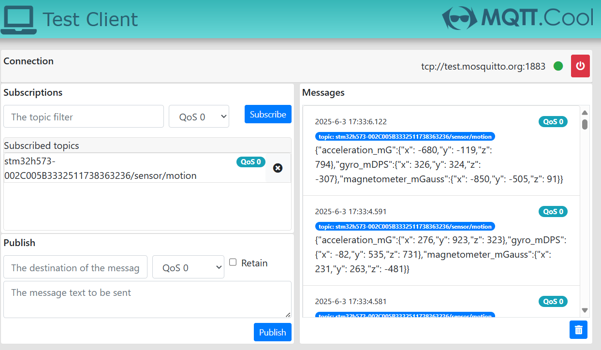
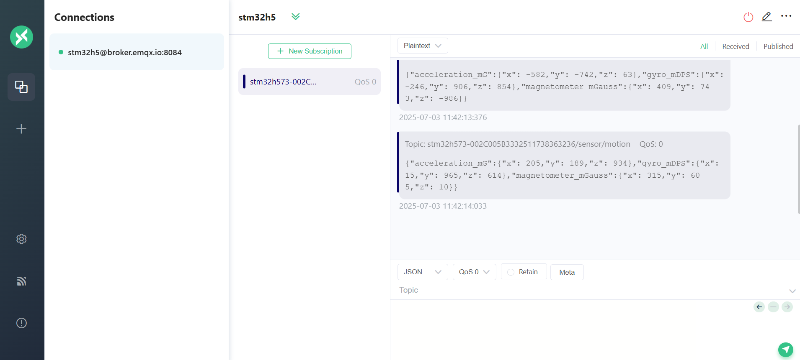

# STM32U585 MQTT Motion Sensor Example (motion_sensors_publish.c)

This example publishes motion telemetry from **B-U585I-IOT02A** to MQTT.

## MQTT Topic

- Publish topic: `<thing_name>/sensor/motion`

Example:
- `stm32u585-002C005B3332511738363236/sensor/motion`

## Payload Format

The firmware publishes this structure:

```json
{
  "acceleration": {
    "x": -543,
    "y": 855,
    "z": 969
  },
  "gyro": {
    "x": 649,
    "y": 720,
    "z": -372
  },
  "magnetometer": {
    "x": 460,
    "y": -554,
    "z": 609
  }
}
```

## Publish Behavior

- Periodic publish interval is defined by `MQTT_PUBLISH_TIME_BETWEEN_MS`
- Topic name is constructed from KVStore thing name + `sensor/motion`

## Monitor Messages

You can use any MQTT client to monitor motion sensor data. Below are two recommended web clients:

Option 1: mqtt.cool for `test.mosquitto.org`

Option 2: MQTTX Web Client for `broker.emqx.io`

Subscribe to:

```text
<thing_name>/sensor/motion
```

Screenshots:
- 
- 

## Firmware Notes

`vMotionSensorsPublish()`:
- initializes IMU/magnetometer
- reads acceleration, gyro, magnetometer axes
- publishes JSON payload to MQTT when connected
