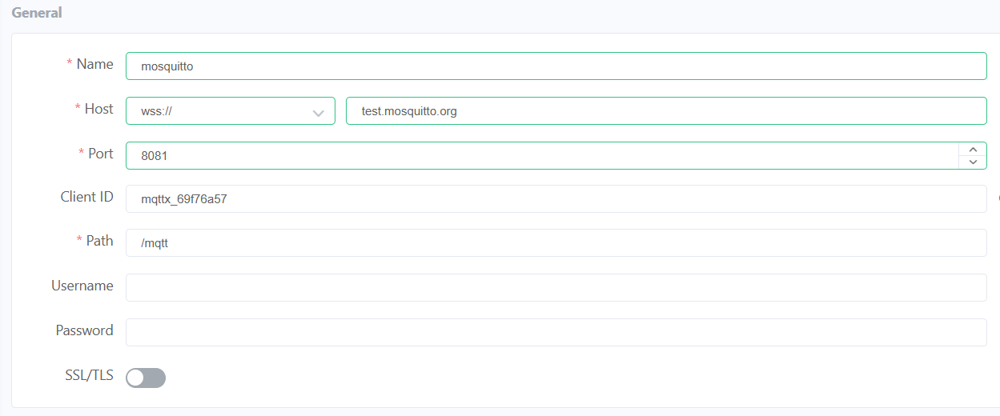
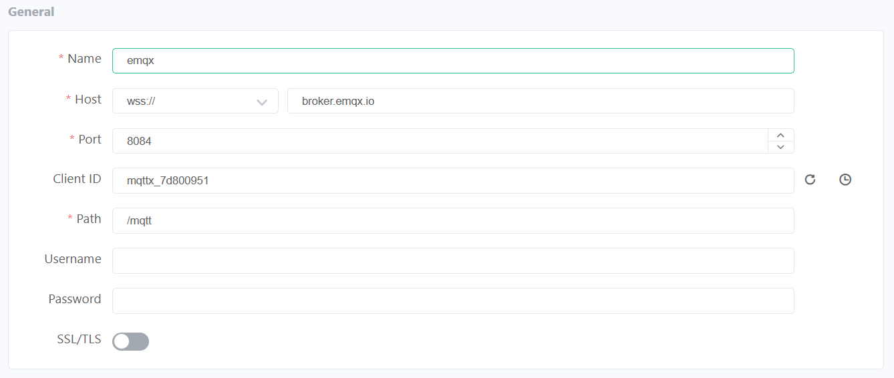

# STM32U585 MQTT Ranging Sensor Example (ranging_sensor.c)

This module reads VL53L5CX ranging data and publishes center distance telemetry to MQTT.

When `USE_RANGING_SENSOR == 1`, it also derives garage door state (`OPEN` / `CLOSED`) using hysteresis and notifies the cover task.

## MQTT Topic

- Publish topic: `<thing_name>/sensor/ranging/reported`

Example:
- `stm32u585-002C005B3332511738363236/sensor/ranging/reported`

## Payload Format

Published payload:

```json
{
  "distance_mm": 742
}
```

## Publish Behavior

- Task: `vRangingSensorTask()`
- Polling period: `1000 ms`
- First valid sample is published immediately
- Subsequent publishes occur when distance delta is at least `5 mm` (`DISTANCE_REPORT_STEP_MM`)
- Publish uses QoS 0 and retained message (`retain = true`)
- Publish is skipped while MQTT is disconnected

## Door State Detection

When `USE_RANGING_SENSOR == 1`, door state is derived from distance:

- `DOOR_OPEN_THRESHOLD_MM  = 500`
- `DOOR_CLOSE_THRESHOLD_MM = 800`

Hysteresis logic:

- `CLOSED` -> `OPEN` when distance `< 500 mm`
- `OPEN` -> `CLOSED` when distance `> 800 mm`
- `UNKNOWN` initializes to `OPEN` if `< 500 mm`, otherwise `CLOSED`

On door state change:

- `gDoorState` is updated
- `EVT_DOOR_STATE_CHANGED` is set for cover task processing

## Distance Calculation

`GetCenterDistance()` computes average distance from the 4 center zones:

- Supports both `4x4` and `8x8` zone layouts
- Uses only zones with `NumberOfTargets > 0`
- Returns `0` if no valid center-zone target exists

## Monitor Messages

You can use any MQTT client to monitor ranging telemetry.

For mosquitto and EMQX, you can use MQTTX Web Client:
- https://mqttx.app/web-client

Configuration for mosquitto:
- 

Configuration for EMQX:
- 

Subscribe to `<thing_name>/sensor/ranging/reported`

## Firmware Notes

`vRangingSensorTask()`:
- initializes and starts VL53L5CX
- builds topic from KVStore thing name
- reads center distance and publishes JSON payload on change threshold
- updates door state and raises event bit when enabled
