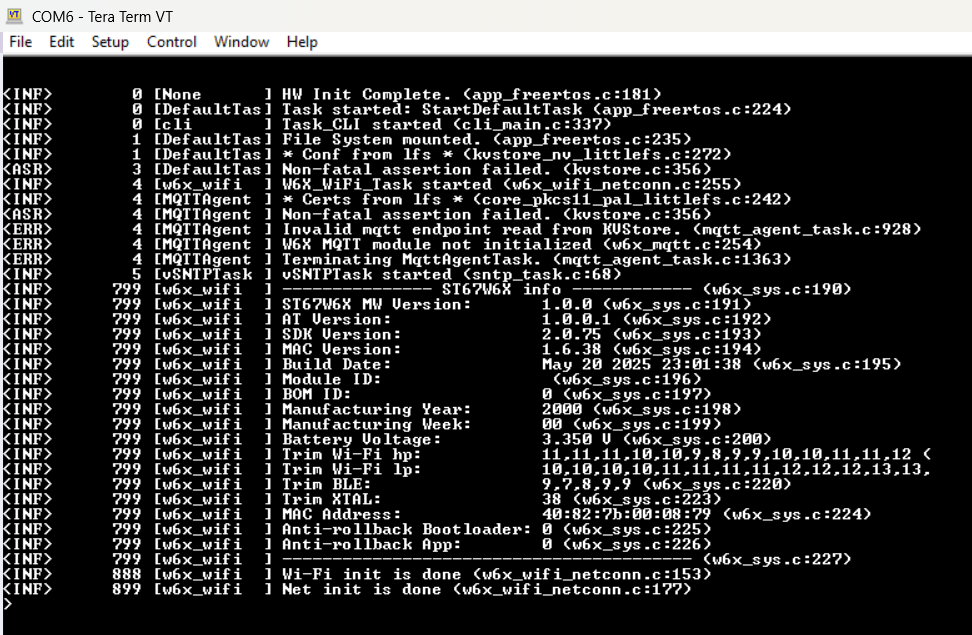
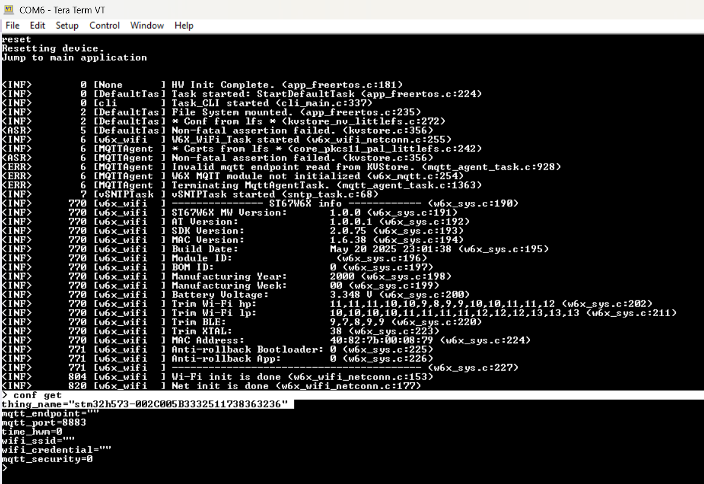
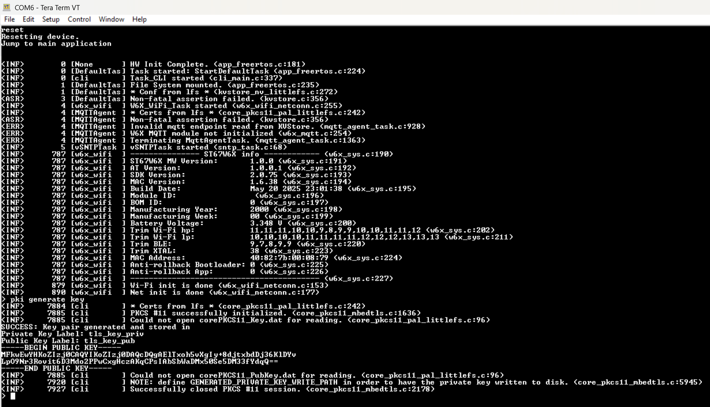
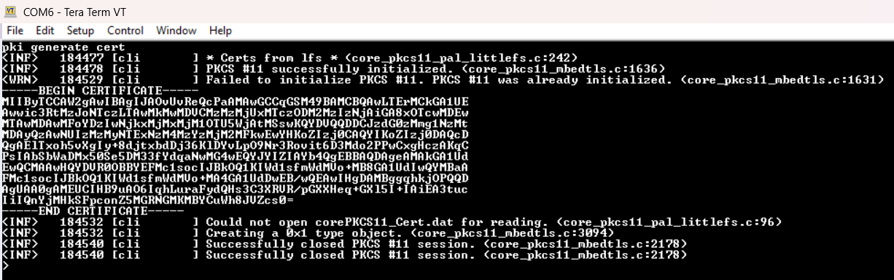
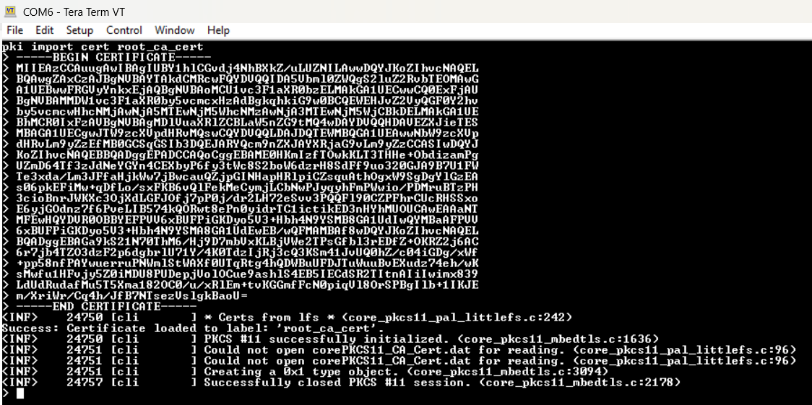
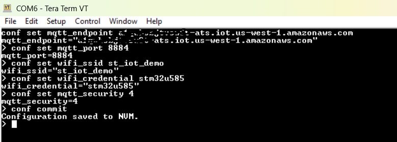
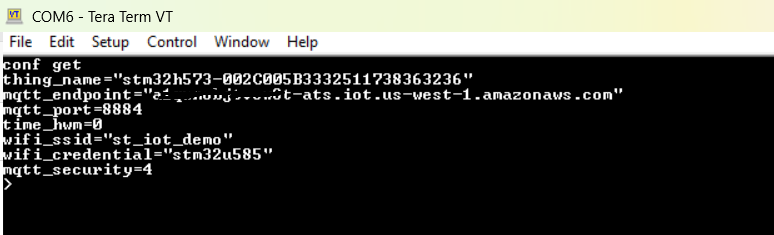
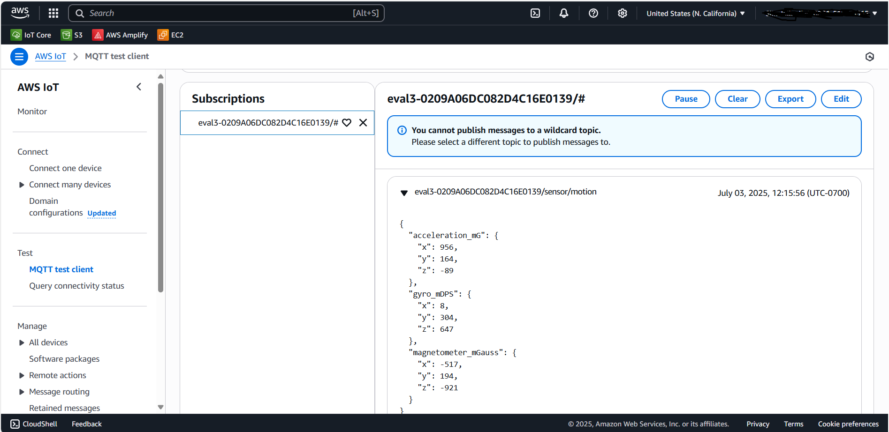

# AWS IoT Core Single-Device Provisioning for STM32U585 (CLI Method)

This guide explains how to provision a **single STM32U585 device** on **AWS IoT Core** using the on-device CLI (manual method). It is intended for developers who want direct control over key generation, certificate registration, and runtime MQTT/TLS configuration.

See AWS background: [Single Thing Provisioning](https://docs.aws.amazon.com/iot/latest/developerguide/single-thing-provisioning.html).

## Supported Build Configurations

| Build Config | Provisioning Method |
|---|---|
| `MXCHIP` / `MXCHIP_Single` | Single Thing Provisioning |
| `ST67_T01` / `ST67_T01_Single` | Single Thing Provisioning |
| `ST67_T02` / `ST67_T02_Single` | Single Thing Provisioning |

## 1. Hardware Setup

- For `MXCHIP`, `ST67_T01`, or `ST67_T02`: connect the Wi-Fi module to `STMod+` or `Arduino`.
- For all profiles: connect ST-Link USB to your PC for power, flashing, and debugging.

## 2. Connect a Serial Terminal

Open a serial terminal (Tera Term, PuTTY, or [web serial terminal](https://googlechromelabs.github.io/serial-terminal/)) with:

- Baud: `115200`
- Data bits: `8`
- Stop bits: `1`
- Parity: `None`



## 3. Get the Device Thing Name

Retrieve the generated Thing/device identifier from the board CLI:

```bash
conf get
```

Save this value for AWS registration and MQTT topic filtering.



## 4. Generate Device Key Pair

Run:

```bash
pki generate key
```

This generates an ECC key pair via MbedTLS and PKCS#11 and stores it in internal flash (LFS/PKCS#11 stack).



## 5. Generate Device Certificate

Run:

```bash
pki generate cert
```

This creates a self-signed certificate from the device key pair and prints it in PEM format.

- Copy the PEM output and save it as `cert.pem`.



## 6. Register Device in AWS IoT Core

### a) Open AWS IoT Console

1. Go to [AWS IoT Core Console](https://console.aws.amazon.com/iot).
2. Select `Manage` -> `Things`.
3. Click `Create things`.

### b) Create Single Thing

1. Select `Create a single thing`.
2. Enter the Thing Name from step 3.
3. Click `Next`.

### c) Upload Device Certificate

1. Select `Use my certificate`.
2. For CA certificate, select `CA is not registered with AWS IoT`.
3. Upload `cert.pem`.
4. Click `Next`.

### d) Attach Policy

1. Create a policy (example name: `AllowAllDev`).
2. Use the following policy document:

```json
{
  "Version": "2012-10-17",
  "Statement": [
    {
      "Effect": "Allow",
      "Action": "iot:*",
      "Resource": "*"
    }
  ]
}
```

3. Attach the policy to the Thing certificate.

### e) Finish

Create the Thing. The device is now registered for AWS IoT Core TLS authentication.

## 7. Download AWS Root CA

```bash
wget https://www.amazontrust.com/repository/SFSRootCAG2.pem
```

Or download manually: [SFSRootCAG2.pem](https://www.amazontrust.com/repository/SFSRootCAG2.pem)

## 8. Import AWS Root CA to STM32

On the board CLI:

```bash
pki import cert root_ca_cert
```

Paste the full `SFSRootCAG2.pem` contents (including `BEGIN CERTIFICATE` and `END CERTIFICATE`) into the terminal.



## 9. Set Runtime MQTT and Network Configuration

Set AWS endpoint:

```bash
conf set mqtt_endpoint <your-aws-endpoint>
```

Set MQTT port:

```bash
conf set mqtt_port 8883
```

For Wi-Fi profiles (`MXCHIP`, `ST67_T01`, `ST67_T02`):

```bash
conf set wifi_ssid <YourSSID>
conf set wifi_credential <YourPASSWORD>
```

For `ST67_T01` (required for TLS mutual auth):

```bash
conf set mqtt_security 4
```

Commit and verify:

```bash
conf commit
conf get
```




## 10. ST67_T01 Only: Delete Old Certificates on ST67 FS

If using `ST67_T01`, remove old files (`corePKCS11_CA_Cert.dat`, `corePKCS11_Cert.dat`, `corePKCS11_Key.dat`) before reset.

List files:

```bash
w6x_fs ls
```

Delete file:

```bash
w6x_fs rm <filename>
```


## 11. Reset and Connect

```bash
reset
```

After reboot, the device connects using the new TLS assets and MQTT settings.

- Standard profiles: TLS/MQTT runs on STM32 host.
- `ST67_T01`: firmware syncs required PKCS#11 cert/key files to ST67 FS if missing, then ST67 handles TLS/MQTT.


## 12. Monitor MQTT Messages in AWS

1. Open [AWS IoT Core Console](https://console.aws.amazon.com/iot).
2. Select `MQTT test client`.
3. Subscribe to your device topic (for example `<thing-name>/#` or `#`).
4. Verify telemetry in real time.



## 13. Run the Examples

After provisioning, continue with:

- [Run the Examples](readme.md#run-the-examples)

---

[Back to Main README](readme.md)
